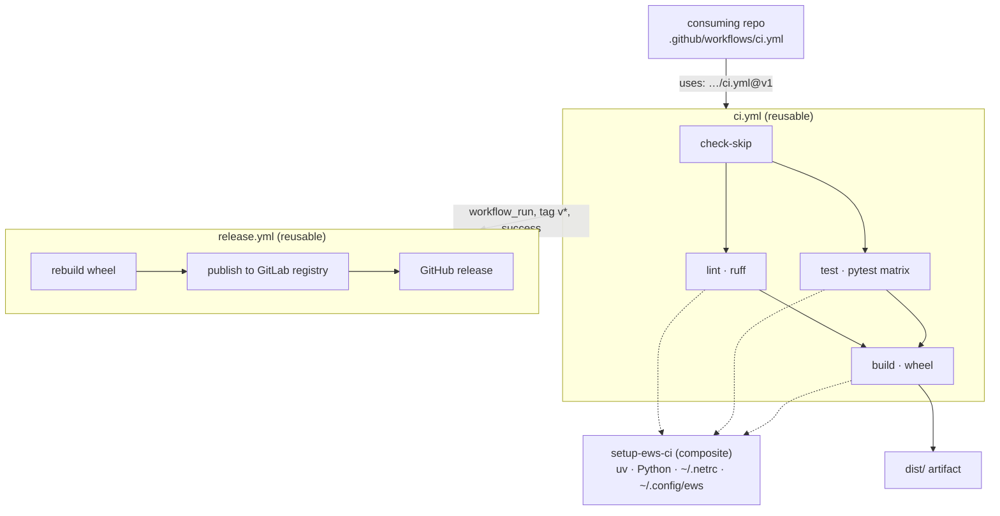

# ews-ci-action — documentation map

**This repository is a runner configuration, not a program.** There is no
`pyproject.toml`, no `src/`, no test suite. Everything it ships is YAML that
GitHub Actions executes on someone else's repository. So the thing to document
is not an API but a **contract**: what a consuming repository must provide,
what the action puts on the runner, and what silently does nothing.

Two things on that diagram catch people out. **Every job calls the composite
action separately** — each is a fresh runner, so credentials and the uv cache
are set up three or four times per CI run, not once. And **`release.yml`
rebuilds the wheel rather than downloading the artifact `ci.yml` uploaded**;
the `dist/` artifact is for humans, not for the release path
([ADR 0005](decisions/0005-release-rebuilds-rather-than-downloading.md)).

## Status legend

Every file under `docs/` carries a YAML header. `status:` is greppable —
`rg "^status:" docs/`.

| Value | Meaning |
| --- | --- |
| `as-built` | Describes what the YAML does **today**. Inputs named here exist. |
| `partial` | Partly shipped; the gaps are marked inline. |
| `planned` | Design intent. **Nothing here is implemented.** |
| `reference` | Background, or a record of something no longer live. |

## The pages

| File | Answers | Status |
| --- | --- | --- |
| [adopting.md](adopting.md) | How does a repository start using this? | `as-built` |
| [action-reference.md](action-reference.md) | What does `setup-ews-ci` write onto the runner? | `as-built` |
| [workflows.md](workflows.md) | Every input, job and condition of the two workflows | `as-built` |
| [credentials.md](credentials.md) | What `EWS_CREDENTIALS` holds and how each key is consumed | `as-built` |
| [releasing.md](releasing.md) | Changing this repository and moving the `v1` tag | `as-built` |
| [decisions/](decisions/) | Why is it like this? | dated ADRs |

Reading order for someone new: this file, then `adopting.md`, then
`action-reference.md`. `workflows.md` and `credentials.md` are lookup.

## Decisions

| ADR | Decision |
| --- | --- |
| [0001](decisions/0001-composite-action-not-javascript.md) | The setup step is a composite action, so it runs in the caller's job and its side effects are files on the runner |
| [0002](decisions/0002-one-credentials-secret-not-many.md) | All credentials arrive as one `EWS_CREDENTIALS` JSON secret, not N repository secrets |
| [0003](decisions/0003-dataset-cache-redirected-into-the-workspace.md) | The dataset system cache is redirected into the workspace, because the runner's default location is not writable |
| [0004](decisions/0004-v1-is-a-moving-major-tag.md) | `v1` is force-moved to the newest `v1.x`; consumers track a major version, not a commit |
| [0005](decisions/0005-release-rebuilds-rather-than-downloading.md) | `release.yml` rebuilds the wheel instead of downloading CI's artifact |

## Not carried forward from the pre-2026-08-07 docs

Three topics from the old root README / examples index were deliberately **not**
rewritten, so that their absence reads as a decision rather than an oversight:

- **The before/after migration guide** — a hand-written consumer workflow
  converted into a caller of these reusable workflows. Its line-count claims
  were never verified against a real repository, and [adopting.md](adopting.md)
  now gives the target shape directly. Anyone migrating writes the caller from
  § 1 and § 2 and deletes the rest.
- **A `release-only` caller pattern** — a repository that releases without
  running CI here. The example file never existed in `examples/`. The use case
  is real; nothing in this repository implements it, so it is not documented as
  if it did.
- **An "adding a new reusable workflow" procedure** — [releasing.md](releasing.md)
  covers changing the existing two, which is what actually happens. A third
  workflow would be an ADR before it was a procedure.

Restoring any of these is a deliberate choice, not a gap to be quietly filled.

## Open questions

Recorded rather than answered, because nothing in the YAML settles them.

- **`ews-credentials-keys` is threaded through four layers and never read.**
  The input is declared on the composite action
  (`action.yml:17-20`), exported as `EWS_CREDENTIALS_KEYS` into the setup
  step's environment (`action.yml:38`), declared on both workflows
  (`ci.yml:56-60`, `release.yml:16-20`) and forwarded at four call sites
  (`ci.yml:112`, `:137`, `:167`, `release.yml:49`) — but **no script anywhere
  in this repository reads that variable.** The validation the input's own
  description promises does not exist. Verified 2026-08-07 by
  `grep -rn 'EWS_CREDENTIALS_KEYS' .github/`, which returns only the
  declaration and the forwarding. Consumers who set the repository variable
  get no check; consumers who omit it lose nothing.
- **`upload-coverage` defaults to `false` while `run-coverage` defaults to
  `true`** (`ci.yml:27-35`), so coverage is collected on every run and
  uploaded on none unless the caller opts in. Whether that is the intent or a
  drifted default is not recorded.
- **The Codecov upload condition compares a string to a JSON array element**
  (`ci.yml:148`): `matrix.python-version == fromJSON(inputs.python-versions)[0]`.
  It is meant to upload once, from the first matrix entry. Not exercised here,
  because `upload-coverage` is off by default.
- **`check-skip` reads `github.event.head_commit.message`**, which is empty on
  `pull_request` events (`ci.yml:77`). `[skip ci]` in a PR's head commit
  therefore does not skip; only pushes are skippable.
- **The `~/.config/ews/` flat copy is labelled "for old tests"**
  (`action.yml:167-170`) with no reference to which tests or which package.
  Whether anything still reads the flat location is unknown.

## Not verified

- **No workflow was executed while writing these docs.** Every behaviour
  described is read from the YAML in this repository, not observed on a runner.
  No credential was exercised, no publish was run.
- The consuming side — which repositories call these workflows, and whether
  their `nox -s build` / `nox -s publish` sessions exist — was not surveyed.
- `astral-sh/setup-uv@v7`, `codecov/codecov-action@v4`,
  `softprops/action-gh-release@v1` and `actions/upload-artifact@v4` are used at
  those major versions; their own behaviour is not documented here.
- Whether anything outside EWS consumes this repository is unknown.
